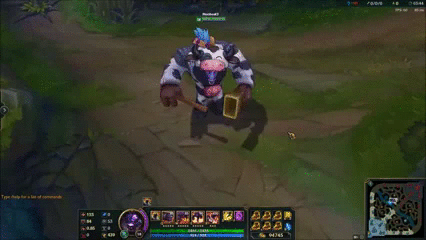

<h1 align="center">
<br>
GadoBot
</h1>

<h3 align="center">Se divirda utilizando esse bot inofensivo no twitter</h3>

<br/>

Projeto desenvolvido para brincar com a API do twitter, com o seguinte funcionamento: Quando alguém marca a conta, ela responde com uma legenda aleatória pré-definida e com um vídeo de um personagem de jogo.

<br/>



## Instalação
### Composer
Abrir um terminal na pasta do projeto e digitar essa linha de código:
```
  composer install
```
### Keys de acesso
Criar na pasta um arqui com nome: "keys.json" e nele colocar as keys no formato abaixo:
```JSON
{
    "API key":"sua_key",
    "API secret key":"sua_secret_key",
    "Access token":"seu_token",
    "Access token secret":"seu_secret_token"
}
```
essas informações você encontra na página de desenvolvedor do twitter.

### Conectar com banco de dados ou criar um SQLite básico
O banco é só pra genrenciar o último twitter respondido, e não repetir resposta.

Requisitos:
 - Banco deve ter uma tabela com nome: last_tweet
 - Tabela last_tweet deve ter uma coluna com nome: id

ou você pode editar diretamente na classe DBOperations

Como usamos:
 - Vá até a pasta src/database (dentro do projeto)
 - Crie um arquivo database.sqlite
 - Crie uma tabela com nome: last_tweet e com o campo: id

Utilizei as seguintes tecnologias:

-  [PHP 7.3](https://www.php.net)
-  [CodeBird-PHP](https://github.com/jublo/codebird-php)

---

Made with ♥ by Daniel Ferreira :wave: [linkedin](https://www.linkedin.com/in/daferreira946/) and Erico Alexandre :wave: [github](https://github.com/ericoabs)
